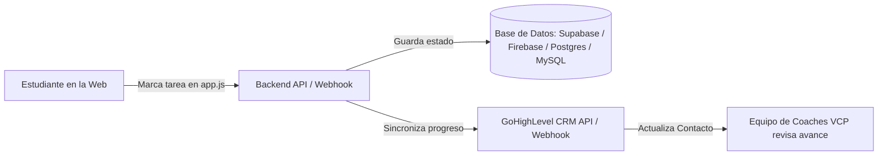

# VCP · Ruta del Éxito · Guía Maestra de Entendimiento y Plan de Acción

> **Propósito de este documento:** Explicar con total claridad de qué trata el proyecto, desglosar qué hay en los archivos actuales, traducir lo que se pide en el audio y trazar la hoja de ruta técnica paso a paso para ejecutarlo con éxito.

---

## 1. En Cristiano: ¿De qué trata este proyecto?

**VendeComoPro (VCP)** es una academia que enseña a personas a vender en **Amazon FBA** (con dos membresías: *Sistema Definitivo / Medium* y *Sistema Élite / VIP*).

Los estudiantes suelen abrumarse con cientos de videos en la plataforma de cursos (Kajabi: `class.vendecomopro.net`). Por eso se creó la **"Ruta del Éxito"**:
* Es una **hoja de ruta interactiva** (como un juego o expedición de montaña) con **12 estaciones** y **5 hitos clave**.
* En lugar de decir "mírate 40 horas de video", le dice al alumno: *"Estás en el Campamento Base. Paso 1: Configura tus accesos. Paso 2: Onboarding con Miguel. Paso 3: Abre tu cuenta de Seller Central..."* hasta llegar a su **primera venta y cobro real**.
* El estudiante va marcando *checkboxes* con las tareas que ya hizo y la web le muestra su progreso visual (barra de progreso, porcentaje y mapa ilustrado).

---

## 2. Radiografía del Estado Actual (Lo que tienes en los archivos)

Si revisas la carpeta `VCP_Ruta_Exito_Para_Jorge_2026-09-18`:

### A. La Aplicación Web (`/web`)
* **Tecnología:** Es una web **100% estática** (HTML5 vanilla, CSS3 y JavaScript puro en `app.js`). No usa frameworks (ni React, ni Vue), no tiene `npm`, no compila y no tiene backend ni base de datos propia.
* **Componentes clave:**
  1. **Selector de Sistema:** `Medium` (6 meses Discord, 1 asesoría/mes) vs `Élite` (12 meses Discord, 2 asesorías/mes).
  2. **Selector de Residencia:** `USA` (preparación en casa con insumos) vs `Fuera de USA` (requiere Prep Center y línea virtual tipo Hushed/TalkYou).
  3. **Dos Vistas:** *Ruta paso a paso* (acordeón interactivo) y *Mapa de expedición* (nodos sobre un mapa ilustrado).
  4. **Descargas:** 5 guías en PDF en `/assets`.
* **EL PROBLEMA CRÍTICO ACTUAL:**
  * El progreso de las tareas se guarda **únicamente en el `localStorage` del navegador** del estudiante (`KEY = 'vcp-success-route-v1'`).
  * **Consecuencia:** Si el estudiante entra desde su teléfono y luego desde su laptop, su progreso no se comparte. Si borra el historial o cookies, pierde su avance. Y lo más grave: **el equipo de VCP no tiene idea de qué ha hecho el alumno**, no pueden monitorearlo ni apoyarlo proactivamente.

### B. Los Documentos de Entrega Previos (`LEEME.md`, `MIGRACION_Y_DOMINIO.md`, `CHECKLIST_DE_ENTREGA.md`)
* Fueron redactados originalmente para una entrega a "Jorge", cuyo alcance original era simplemente **sacar la web de ChatGPT (`*.chatgpt.site`) y montarla en un hosting con dominio propio de VCP** (`ruta.vendecomopro.net`) protegiendo el acceso con contraseña o portal privado.

---

## 3. Análisis Profundo del Audio (La Pieza Clave que lo Cambia Todo)

El audio `audio_clip_2026-09-30_13-58-00-131.m4a` (1 min 29 seg) es la clave para entender lo que realmente necesita el negocio hoy.

### Puntos textuales e intenciones del audio:
1. **El Rol de Kajabi vs GoHighLevel:**
   - Kajabi es la plataforma de cursos donde los alumnos ven los videos (`class.vendecomopro.net`).
   - GoHighLevel (GHL) es el CRM / sistema de operaciones de VCP donde gestionan los contactos, mensajes, llamadas y seguimiento del equipo.
2. **Prioridad Número 1 (Lo Urgente):**
   - *"La prioridad es exacto, que ellos puedan entrar ahí, es como una hoja de ruta del curso..."*
   - Que el estudiante entre a su link como parte del **Onboarding**.
   - **Guardar la data en una Base de Datos real:** Ya no dejarlo solo en `localStorage` / ChatGPT.
   - **Sincronizar esa data con GoHighLevel (GHL):** *"La idea es que la data también se guarde a nivel de base de datos y esa data se sincronice en GoHighLevel para que obviamente se pueda revisar... puedan revisar toda la información".*
3. **Prioridad Secundaria / A Futuro (El Embed en Kajabi):**
   - *"Y lo de Kajabi el embed es como para que no tengan un sign in para ese dashboard y un sign in para Kajabi... pero como te digo, eso sería lo menos importante. Lo importante ahorita es que puedan entrar, ellos sí activar como su cuenta... y vayan viendo cómo va fluyendo".*

---

## 4. El "Qué Hay Que Hacer" (Objetivo General)

Transformar la web estática actual de "Ruta del Éxito" en una **plataforma conectada**, donde:
1. Cada estudiante esté identificado (por su correo/id de VCP/GHL).
2. Cuando marque una tarea en la web, **su progreso se guarde en una base de datos**.
3. Esos avances se envíen automáticamente a **GoHighLevel** (actualizando campos personalizados o notas en el contacto del estudiante).
4. El equipo de coaches (Oriana, Sofía, Miguel, etc.) pueda entrar a GoHighLevel y ver en qué estación está cada alumno, qué porcentaje lleva y si está listo para agendar su sesión 1 a 1.

---

## 5. Arquitectura Sugerida (Simple, Rápida y Robusta)

Para no rehacer la web desde cero (que ya está visualmente bonita y probada), la estrategia más inteligente es **potenciar lo que ya existe**:

### Componentes:
1. **Frontend (`web/app.js`):**
   - Mantener el diseño y lógica de las 12 estaciones.
   - Añadir captura de identidad del alumno (vía URL `?email=...&token=...` o un modal de bienvenida/login ligero con su correo de compra).
   - En la función `setTask()` de `app.js`, además de guardar en `localStorage` (para funcionamiento offline o instantáneo), hacer un `fetch('/api/progress')` con el cambio.
2. **Backend / Servidor de Datos:**
   - Puede ser un microservicio (Node.js/Express, PHP/Laravel, Next.js API Routes, o directamente **Supabase / Firebase**).
   - Tabla `students` (id, email, nombre, sistema, residencia).
   - Tabla `student_tasks` (student_id, task_key, completed, updated_at).
3. **Sincronización con GoHighLevel (GHL):**
   - GHL permite crear **Campos Personalizados (Custom Fields)** en el Contacto:
     - `Ruta_Estacion_Actual` (Ej. "Estación 3: Apertura de cuenta")
     - `Ruta_Progreso_Porcentaje` (Ej. "25%")
     - `Ruta_Tareas_Completadas` (Ej. "14 de 58")
     - `Ruta_Ultimo_Hito` (Ej. "Cuenta lista")
   - Cuando el alumno completa una estación o hito, el backend llama a la API de GHL (`POST https://services.leadconnectorhq.com/contacts/{contactId}`) o dispara un Webhook a un Workflow de GHL.

---

## 6. Plan de Acción Paso a Paso (Roadmap de Implementación)

### Fase 1: Dominio y Publicación Base (El entregable inicial de Jorge)
* [ ] Elegir y configurar el subdominio aprobado con Oriana (ej. `ruta.vendecomopro.net`).
* [ ] Alojar los archivos de `web/` en un servidor/hosting con HTTPS activo y certificado SSL válido.
* [ ] Proteger el acceso temporalmente (Basic Auth o firewall) hasta que Oriana dé luz verde para estudiantes.
* [ ] Verificar que los 5 PDFs y assets cargan correctamente sin enlaces rotos.

### Fase 2: Identificación del Estudiante y Base de Datos
* [ ] Definir cómo se identificará el estudiante:
  - **Opción A (Recomendada para Onboarding):** Al comprar en Kajabi/GHL, un Workflow le envía un correo con su enlace personalizado: `https://ruta.vendecomopro.net/?email=alumno@correo.com&token=xyz`.
  - **Opción B:** La primera vez que entra, le pide su correo con el que se registró en la academia.
* [ ] Crear la base de datos (por ejemplo, Supabase o una base de datos relacional).
* [ ] Modificar `web/app.js`:
  - Al cargar la página, recuperar el progreso del servidor para ese alumno.
  - Al hacer click en un checkbox (`setTask`), enviar el estado al backend.

### Fase 3: Conexión con GoHighLevel (El Requerimiento del Audio)
* [ ] Crear en GoHighLevel los Custom Fields necesarios para el seguimiento del alumno.
* [ ] Configurar la sincronización:
  - Cada vez que el estudiante avance o complete una estación, enviar un payload a GHL.
  - Opcional: Crear workflows de automatización en GHL (por ejemplo: si completa la Estación 7 "Envío a Amazon FBA", enviar un correo felicitándolo y recordándole agendar su sesión 1 a 1 con Sofía Mesa).

### Fase 4: Integración Futura con Kajabi (Fase 2 / Menor Prioridad)
* [ ] Evaluar si se embebe vía `<iframe>` dentro de un producto o lección de Kajabi, pasando el ID del usuario por query params o JWT, logrando una experiencia integrada sin login doble.

---

## 7. Preguntas de Clarificación que Debes Hacer a tu Equipo o a Oriana

Para empezar a tirar código con precisión quirúrgica, necesitas confirmar con ellos:

1. **¿Qué stack prefieren para el backend?**
   - ¿Ya tienen un servidor/VPS (Node, PHP/Laravel, Python)? ¿O prefieren una solución serverless tipo Supabase/Firebase/Vercel?
2. **¿Cómo entra el alumno al Onboarding?**
   - ¿Se le enviará un correo automatizado desde GoHighLevel con su link personalizado?
3. **¿Tienen ya la API Key / Location ID de GoHighLevel?**
   - Para configurar la conexión con el CRM.
4. **¿Dónde se alojará el frontend?**
   - ¿Hostinger, Vercel, Cloudflare Pages, AWS, cPanel?

---

*Documento generado para el equipo de desarrollo de VendeComoPro.*
